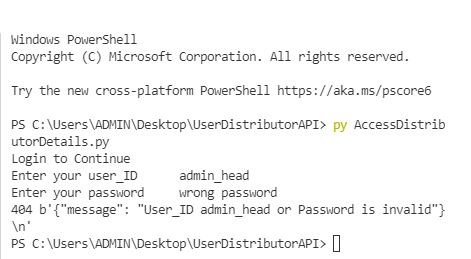

# UserDistributorAPI
A simple API that validates a Users Login. Checks if the user is admin or not and provides the functionality of accessing, deleting, editing and adding records to User and Distributor array. Uses Flask-Restful APIs for reading and sending requests.

## Entering Correct Password and Login(POST REQUEST)

## Entering Wrong Password Error

## Post Request is Made to Login Resource to match Password

## User Functions by Selecting U after Login

## Using a Function

# Search Function(GET REQUEST)

## Search uses GET Request

## Search by Name

## Search All

## Searching Not Present

# Adding New User(POST REQUEST)

## New User Created

## New User is Created by POST request

# Edit User Details

## Trying to Edit non present user

# Deleting User(DELETE REQUEST)

## Trying to delete non present user

# Non Admin Trying to access Delete, Add and Edit Menu

### Non Admin user cann't Delete, Add and Edit User details or Distributor details just View them

# Distributor Menu

# Search in distributors(GET REQUEST)

Similar to User search

# Adding distributor(POST REQUEST)

# Extending distributor contract by changing created at to current time stamp(PUT REQUEST)

## Trying to Extend Contract of Non Present User

# Canceling Distributor Contract(DELETE REQUEST)

# When non Admin User tries to Edit, Delete or Add Distributor

Non Admin user can only view Distributor records not Edit, Delete or Add them